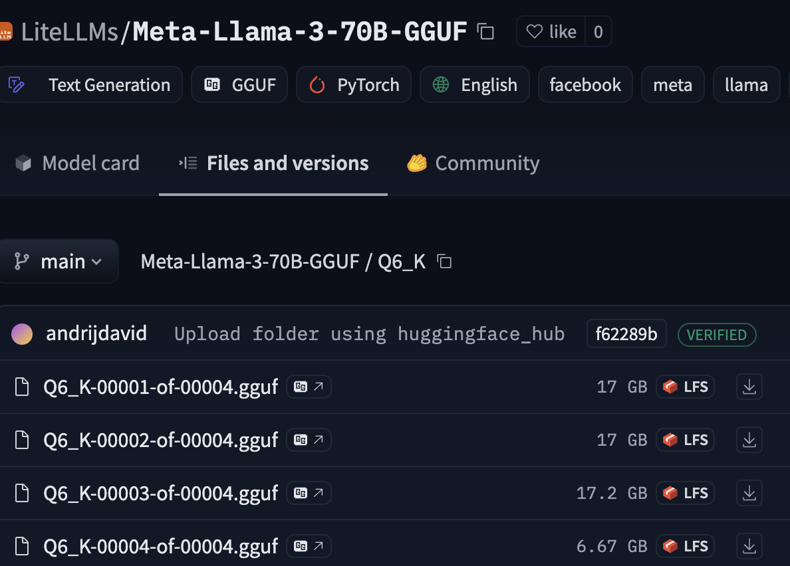
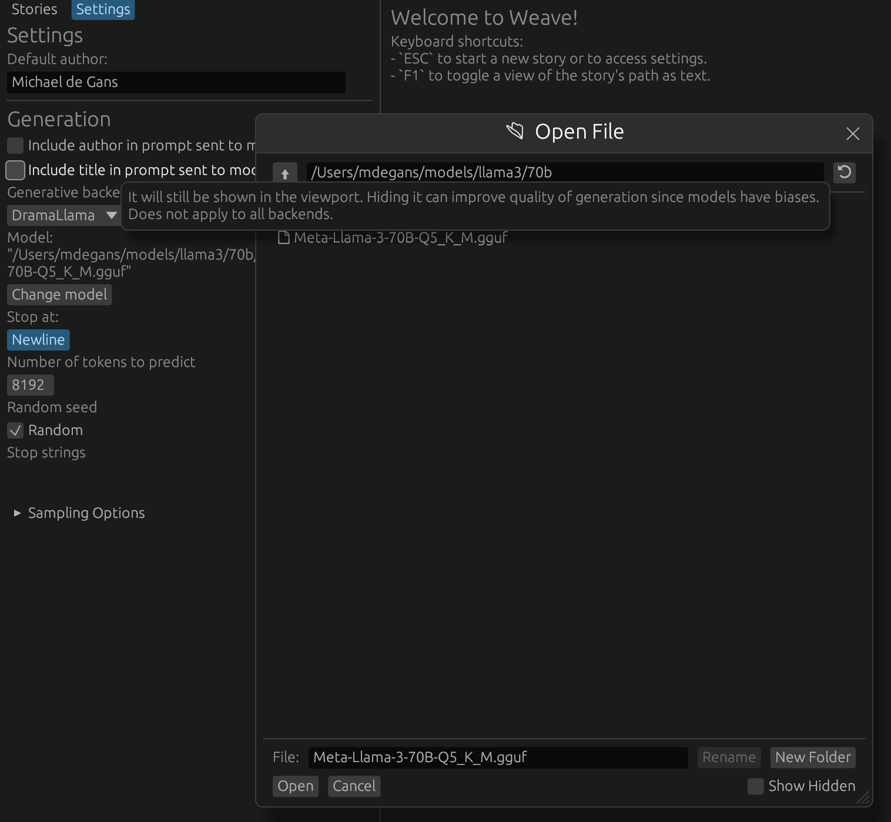
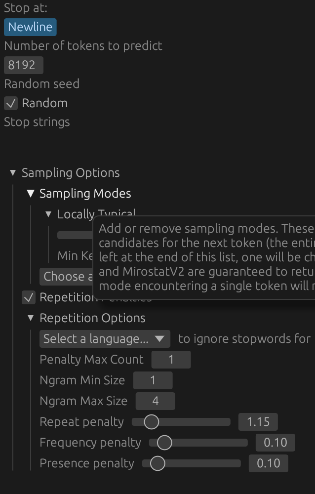

# LLaMA Howto

To get LLaMA working, first you will need the model. You can get them [here](https://huggingface.co/LiteLLMs/Meta-Llama-3-70B-GGUF/). You should choose the biggest one you can fit in memory. If you have Mac with 96GB ram, for example, you can run LLaMA 70b at 8bit quantization. 6bit will be slightly less quality but still very close. If you have less memory, you may need to use a smaller model (eg, 7b).

You _do not_ need to register with HuggingFace to download the model. Simply click the download buttons (down arrows) shown below. If there are multiple parts, you will need to download all of them.

All you need to do from here is make sure all the files are in the same folder and load them in "Settings" > "Change Model" shown below.

## Settings

### Stop at Newline

If "Stop at Newline" is set, generation will stop when a newline is reached. This is useful for generating paragraph by paragraph. Alternatively generation can be manually stopped by clicking the "Stop" button during generation.

### Number of Tokens to predict

The maximum number of tokens to predict. This cannot be set higher than what the model supports. For example, LLaMA 3 has a 8196 context window. If you set this to 10000, it will be clamped to 8196.

### Random Seed

If "Random" is checked, a random seed will be used for generation. This is useful for generating multiple, unique, child nodes from the same parent. If "Random" is unchecked, the seed will be set to `drama_llama`'s default seed. Generations from the same text should be identical. Deterministic results are not guaranteed across different hardware or software.

### Sampling Modes

Unlike `llama.cpp`, `drama_llama` supports multiple sampling modes. You can use any combination of any of the sampling modes available in the dropdown, even if they don't make sense. The general idea is you start with all possible candidates (the entire vocabulary) and then filter them down to a smaller set. A description of each is available on hover.

If, at the end of the list, there is still more than one candidate, one is chosen at random weighted by the probabilities of the remaining candidates. The defaults will always be the best available for story writing at the time of release, but this is subjective, so feel free to experiment.

### Repetition Options

Also unlike `llama.cpp`, `drama_llama` supports penalizing token n-grams, not just unigrams. "Penalty max count" determines how many times an n-gram can appear before it is penalized. "Ngram Min Size" and "Ngram Max Size" determine the range of n-grams to penalize. These stack so longer sequences that repeat will be penalized more. It's for this reason that the repeat penalty doesn't need to be as high as in `llama.cpp`. A range of 1-1 will have identical results as in `llama.cpp` The individual penalties work the same way as in `llama.cpp` and OpenAI's API.

Note that some sampling methods like "Locally Typical" may not need much of a repetition penalty, but it's there if you want it.

## Legal

You _do not_ need to accept any license agreement to download or use LLaMA. The US copyright office has stated that model weights are [_not copyrightable_](https://law.stackexchange.com/questions/90429/what-ip-law-would-apply-to-trained-weights-of-an-ai-model) and therefore, if you do not accept any license agreement, you are free to use the model weights any way you see fit.

**HOWEVER** use of this crate/app _does_ require acceptance of a relatively restrictive ["Responsible AI" license](../LICENSE.md). If you don't want to accept this license, use `text_generation_ui` or whatever other tool you like.
