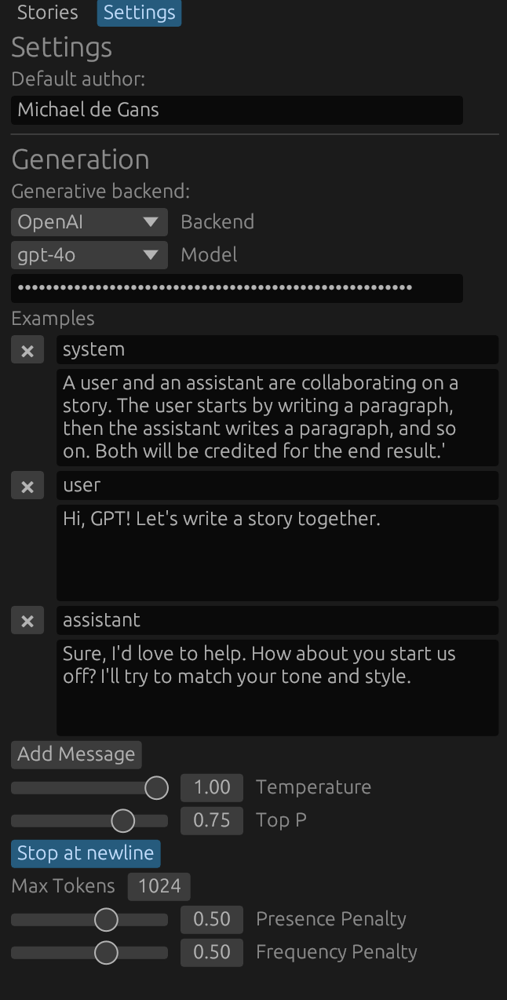

# OpenAI Howto

To use the OpenAI backend, you will need an API key. Get one [here](https://platform.openai.com/signup). Once you have your key, you can set it in the settings dialog.

It is stored securely in your system's keychain using the `keyring` crate. You will need to authenticate the first time you use it and allow the app to store the key.

## Settings

The settings should be relatively straightforward. You can set example (System prompt and some initial messages to bootstrap the story writing) as well as the usual settings such as max tokens, temperature, top p and repetition penalties.

"Stop at Newline" can be clicked to stop generation at the first newline. This may or may not be desirable given all previous tokens need to be injested for each new generation, so to get your money's worth, you may want to generate larger posts and then potentially edit them down or split them up.

## Notes

- In the future we will add support for the **["Assistants" api](https://platform.openai.com/docs/assistants/how-it-works)** which allow caching of threads so we can avoid injesting all tokens for each new generation, however we will need to store one thread for every possible path and invalidate this cache when upstream nodes change.

  This is a non-trivial amount of work and will be done when we have time, however it should be more efficient than the current system. It may also allow for more advanced features tied to the Assistants API like function calls, however it's not clear how this might be useful for story writing.

- Not all models listed in the dropdown are supported (for example, Whisper). In the future we will filter models that do not support the APIs we use.

- Images are not yet supported but support is planned since GPT-4 and 4o are multimodal models and the API does support this.
